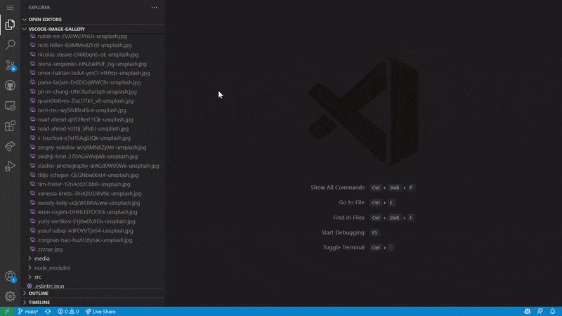

# Image Gallery

A light-weighted extension that brings you the best image browsing experience in VS Code.

## Features
- Smooth panning and zooming
- Gallery view of images
- Lazily load images as they are scrolled into view
- Collapsible subfolders
- Clicking on an image opens it up in a viewer tab
- Auto-refresh when modified
- Extension size less than 1 MB

### Panning and zooming

### Gallery view

See [here](docs/photo_credits.md) for the photo credits.

## Like this work?
- ⭐ Star this project on [GitHub](https://github.com/geriyoco/vscode-image-gallery) and [Visual Studio Marketplace](https://marketplace.visualstudio.com/items?itemName=GeriYoco.vscode-image-gallery)
- ↪️ Share with your friends: [Twitter](https://twitter.com/intent/tweet?text=Just%20discovered%20this%20on%20the%20%23VSMarketplace%3A%20https%3A%2F%2Fmarketplace.visualstudio.com%2Fitems%3FitemName%3DGeriYoco.vscode-image-gallery), [Facebook](https://www.facebook.com/sharer/sharer.php?u=https://marketplace.visualstudio.com/items?itemName=GeriYoco.vscode-image-gallery)
- 🖥️ Contribute to the project
